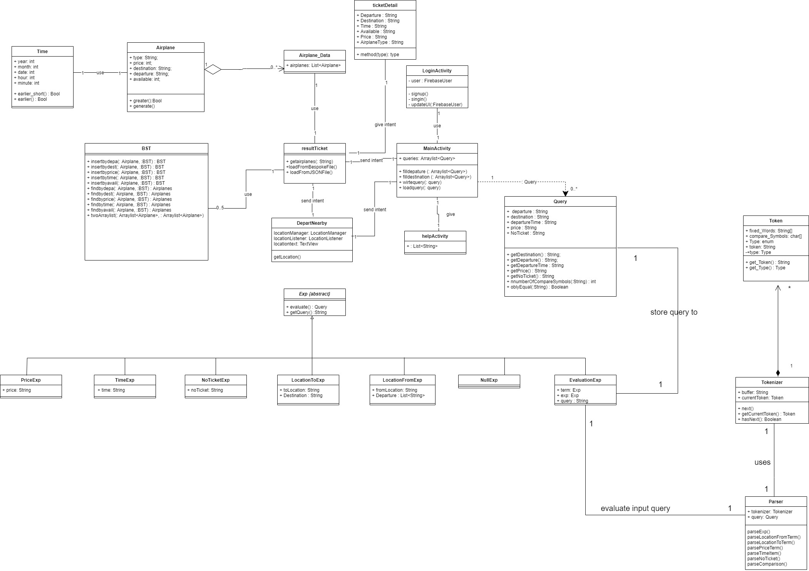
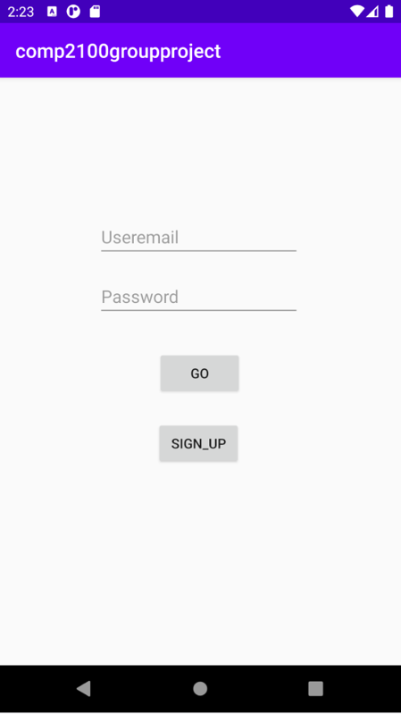
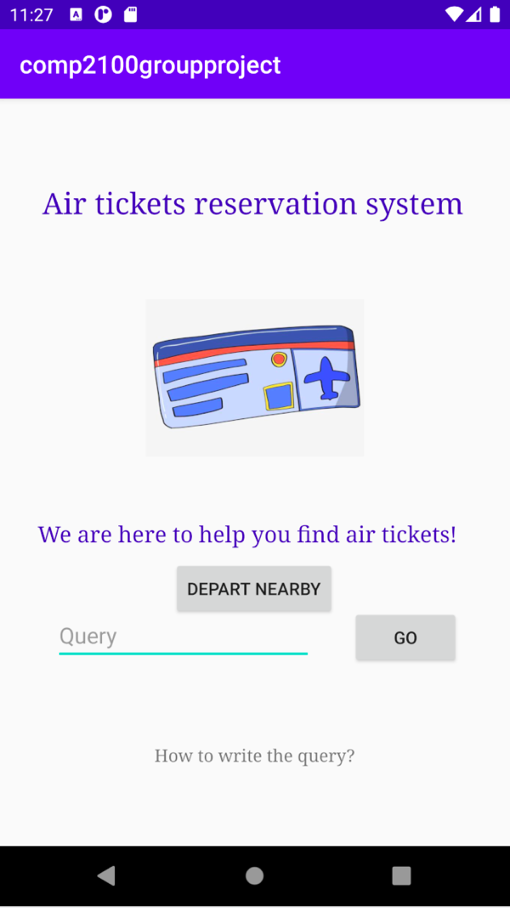
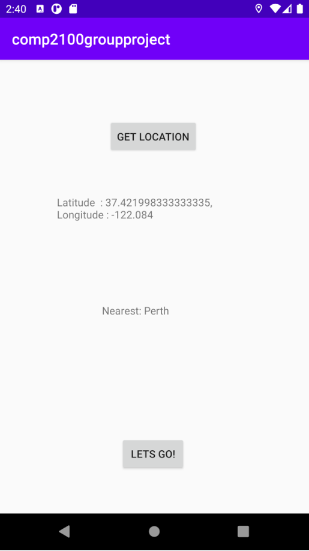
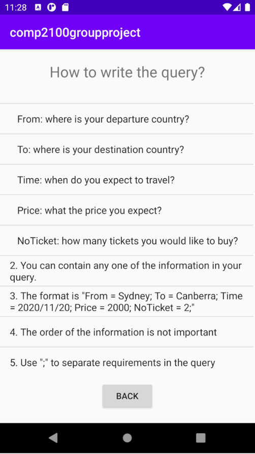
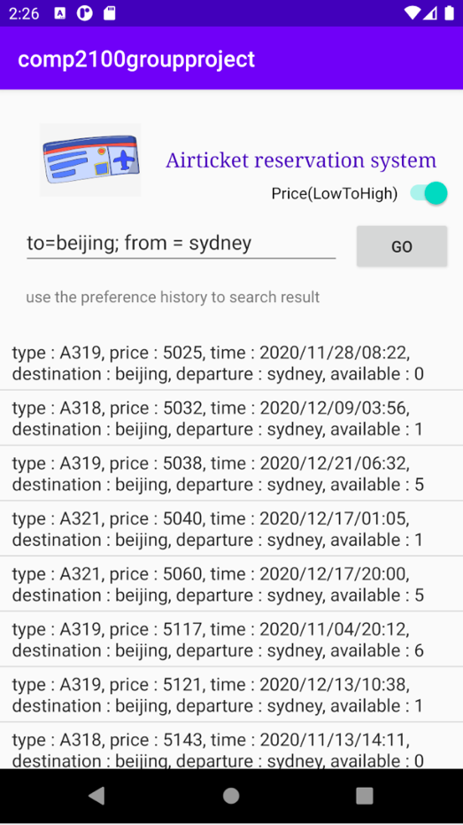
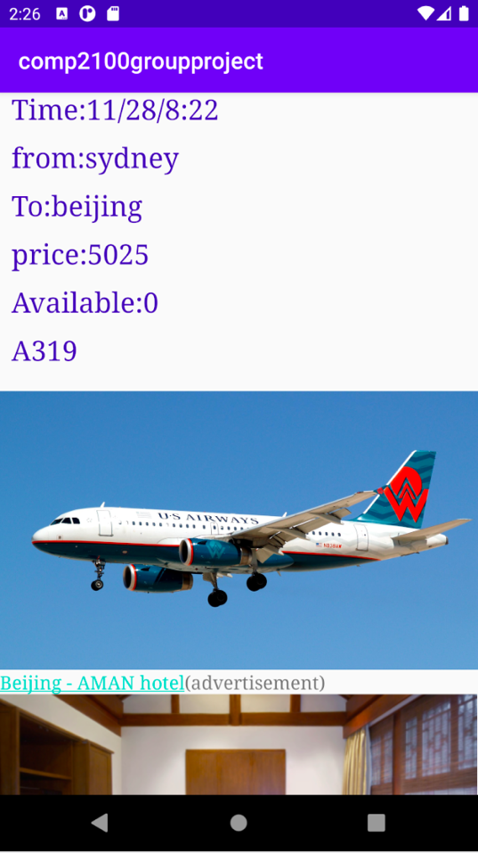

Sample group project repo for COMP2100/6442 (see [Wiki](https://gitlab.cecs.anu.edu.au/u1064702/comp2100_6442_s2_2020_group_project/-/wikis/home))

### App -- 

### Team name -- Hello 2100???

### Team structure and roles
All of three – Work on the foundation of all the classes that we created in this project.
* u6834422 Jiayu Xu – Mainly focus on the BSTree.
* u6834093 Anran Xu – Mainly focus on building up the activities and user interface.
* u6848764 Zhicheng Zou – Mainly focus on the Tokenizer and Parser.
### Design and meeting summary:


We mainly have three offline meeting during the whole project.
1.	Decide what we are going to build / figure out our parser / finish some basic features
2.	Discuss some advanced features, confirm our division of labour for this stage.
3.	Finishing up.

After we decided to write a ticket reservation program, we finished all the basic features in the first stage. Like tokenizer and parser, some generator for the attributes we are using and the creation for main activities.

For the tokenizer and parser part, the most difficult work was to figure our what our grammar should be. After discussion for about a half day, we confirmed what it should be like:

```
 * <exp> -> <term> | <term> ; <exp> ;
 * <term> -> <terminal> <compare exp> <query>
 * <terminal> -> "from" | "to" | "price" | "time" | "NoTicket" // the upper and lower case should not matter
 * <compare exp> -> <compare symbol> | <compare symbol> <compare symbol> // the compare expression should composed of one or two compare symbols
 * <compare symbol> -> ">" | "<" | "="
 * <query> -> <string> | <containsDigit> (can be the "time" and the "price")
 * <containsDigit> -> <unsigned integer> | <unsigned int><|><unsigned int><|><unsigned int> (if have "/" then it should be time otherwise it could be price of ticket or the number of ticket)
 ```

Second, we worked together to figure out some more features we are going to focus in the next step, and had a new division of labour.
Like how the information of tickets are listed? How to present the detailed information in the final pages? The ‘surprise’ file was also posted at this stage, we commit some more advanced changes based what we have done in the last turn.

For the advertisement part, we decide to promote advertisements for hotels based on the destinations of the ticket. We found out photos for the hotels in each destination and add a hyperlink of the official website above of each. The code was like
(for Beijing)

```
ImageView hotel = (ImageView)findViewById(R.id.hotel);
if (Destination.equalsIgnoreCase("beijing")){
    hotel.setImageResource(R.drawable.beijing);
}

TextView ad = (TextView)findViewById(R.id.ads);
if (Destination.equalsIgnoreCase("beijing")){
    String ad_pk = "<a href='https://www.aman.com/zh-cn/resorts/aman-summer-palace?gclid=Cj0KCQjw8rT8BRCbARIsALWiOvRK8IErX3ujALvn9gVyoFKvm-WvFnG0SVkgyJtxHDKSkpWhp3au6B0aAho6EALw_wcB&gclsrc=aw.ds'>" +
            "Beijing - AMAN hotel</a>";
    ad_pk += "(advertisement)";
    ad.setMovementMethod(LinkMovementMethod.getInstance());
    ad.setText(Html.fromHtml(ad_pk));
}
```
All the basic features are already done when we come to the final step. In this stage, we mainly focus on those parts: the firebase, dealing with the invalid query and do some comprehensive checking.


### List of examples and app summary:
In this assignment, we wrote a program which is for air tickets reservation system. 
After running, you can sign up or log in from the first page:




After log in, a title and an input box will be seen and with a helper at the bottom of the interface.




On this page, you can see there’s a ‘getLocation’, which could use GPS to locate where you are and could be helpful for you to search for where you could go from where you are. 



Also you can choose to type the query yourself in the input box.
Click the helper, you can see the grammar that how you should type in the box to search up for what you’re looking for.



After typing in the box, click go. All the tickets that satisfies your query will be listed on the page, the input box will be put at the upper side which you can continue to use it to do your following search.



You can choose which ticket you’d like to learn more then click it. Later you will go to the final page which is with detailed information about your flights and the advertisements are also listed below.



### List of implemented features:

#### Default features:
1.	Activity:  MainActivity, helperActivity, resultTicket(The retrieved result), ticketDetail
2.	We implement binary search tree. (BST class). 
3.	Tokenizer and parser: in the token, tokenizer, parser classes, abstract Exo class and classes extend this class
4.	We retrieve data from the JSON file.
5.	We create 10000 instances. 

#### Advanced  features:
6.	We apply constraint layout for nearly all the activities, the reason was that constrains layout could make the interface much pretty. However, we apply the linear layout for the ticketDetail activity for the reason that which was mainly for listing detail. This means which doesn’t need that much format.
7.	We have applied these features for all the activities.
8.	We used both JSON and Bespoken, The JSON was for saving the format and the Bespoken was for preventing data corruption.
9.	We use GPS information to locate where the user are. (departNearby class).
10.	Our parser can accept partially valid queries such as with the information only ‘From = sydney’. Also invalid queries such as ‘shanghai = to’. (parser class).
11.	Use firebase to implement user authentication (MainActivity 272-299).

#### Surprise:
1.	We added a new ranking algorithm which will list the result based on the price when the switch was checked (line 106 to 148, resultTicket class).
2.	Log previous searches (mainActivity 272-299).
3.	We added advertisement promotion (line 79 to 134, ticketDetail class).

### Testing Summary

1.	the test is composed of three parts, first we test the “Tokenizer” class to check if the “Tokenizer” works properly. The second part tests the “Exp” abstract class and the classes that implement this class. The third part is to test the “Tokenizer” class to check the tokenizer can recognize the valid query, partial valid query, and invalid query.
 
2.	The “Tokenizer” class test:
  What we have covered?
  When the input string is null
  When there is one token in the string
  When there are comparison symbol and unknown symbol in the input string
  When the input string is different combinations of tokens.
  The “Time” in our grammar is restricted, so we add an extra test to test the invalid input time and valid input time.
 
Classes and coverage?
  Token : method coverage: 100%
  Tokenizer: method coverage: 100%

3.	The “Exp” abstract class test:
  What we have covered?
  The methods of “getQuery()” and “evaluate()” for each class that extended the “Exp” class 
  Test the result of different combinations of expressions.
  Test the evaluation of the null expression.
  Tests when there exists some spelling errors, can still get the correct result.
  Tests when there are two same expression, should return an exception
 
  Classes and coverage?
  Classes: Exp, LocationFromExp, LocationToExp, NoTicketExp, NullExp, PriceExp,          TimeExp
  Coverage: method coverage 100%

4.	The “Parser” class test:
  What we have covered?
  Parse the input string with single expression combination.
  Parse the input string with different expression combination.
  Parse the input string with grammar errors, for example start with “Sydney” rather than fixed word “from” (the correct grammar is “from = Sydney”), the parse will correct the grammar and output the correct result.
  Parse the input string that will throw an exception
  Parse the input string that contains duplicated semicolon the parse can still recognize it, since in the grammar we use the semicolon to separate different expression.
Classes and coverage:
  Parser: method coverage: 92%

5.	The method generate() which used to generate random data.
6.	All method used to build BSTree and retrieve data from the tree. 
7.	The method used to find the nearest departure in GPS (advanced 9).
8.	The method used to fill the query (surprise2).
9.	The method used to find suitable flights through query.
10.	The method used to compare time and location.


### Personal Reflection:

- Jiayu Xu

We meet in person almost every day, assigning tasks every morning and summarizing before leaving. All of us believe that everyone has made equal contributions to the team. We are all happy to contribute to the team, so we can complete such an app in a short time. All major decisions are made by the group. When conflicts or confusion arise, we also communicate in time, we did a good job in this part. For me, I tried some cool things, such as firebase. So, data can be written and read when the user ruing it. This assignment improved my coding level and cooperation ability, it is a very satisfying group assignment.

- Zhicheng Zou

What do we need to improve?
1. the grammar of the query is rigid, so it restricts the usability of the users, even though I have adjusted the parser to make it can recognize the query even there exists some grammar mistakes or spelling mistakes. Perhaps for the future design, we need to consider to create a flexible grammar that has higher fault tolerance, since it’s hard for the user to memorize the grammar.
2. perhaps we can improve the UI and add some helper widgets to make it more comfortable and easier for users to use.
3. the “advertisement part of the advanced feature, we are only adding relative hotel information, perhaps need more interactive advertisement,
4. We were trying to implement the UI tests, but not make it.
What aspects we are doing great?
1. Having a good work distribution, each team member is responsible for one main part of the project. And integrate these parts together to make it work!
2. customized data types
  We have many different customized data types (for example “Query” class for storing the query that user typed in a fixed form), which is consistent and efficient for afterwards programming and data retrieving.

- Anran Xu 

Our group was working nicely together, we have clear division of labour. One of us most focus on the token, another one most focus on the BSTree, and I am mostly working on the android activity and everything relating to the user interface.
In the first stage, we firstly decided which options of the basic and advanced feature we are going to attempt to. Following on, we sit together twice a week to have code review and decide what to do next. This makes me familiar with every single code in our project even which was not written by myself, and I could feel easier to add something based on other’s code.
Interesting project and nice group work!


### Statement of Originality

I declare that everything I have submitted in this assignment is entirely my own work, with the following exceptions:


